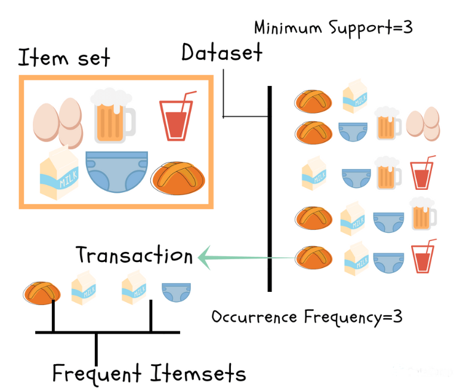
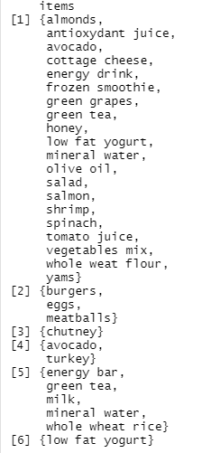
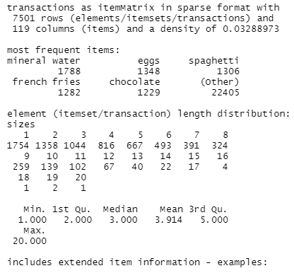
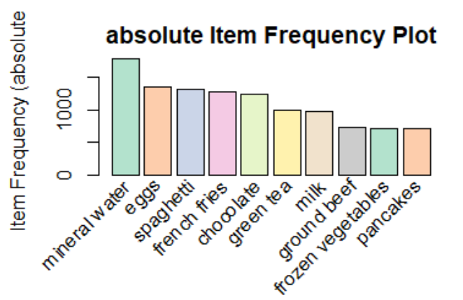
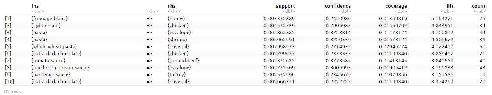
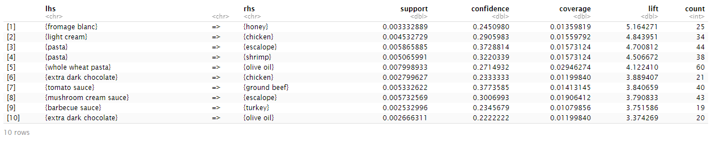
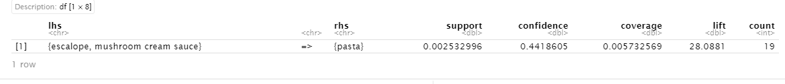
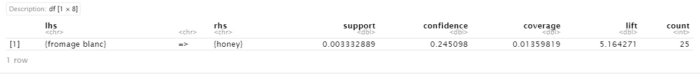

# Market-Basket-Analysis (MBA)

## Overview
Store are interested in determining the associations between items purchased from its Departments. The store chose to conduct a market basket analysis of specific items purchased to analyze customer’s buying behavior. dataset provided is ‘transactions.csv’ containing information for transactions made over the past 3 months
## Example
### **Let's read the transactions from the CSV**
```{r}
# read the transactional data
transactions <- read.transactions("transactions.csv", format = 'basket', sep = ',')
inspect(head(transactions))
```


### Look at the data summary
```{r}
summary(transactions)
```


### Find the most 10 frequent transactions
```{r}
arules::itemFrequencyPlot(transactions, topN = 10,
                          col = brewer.pal(8, 'Pastel2'),
                          main = 'absolute Item Frequency Plot',
                          type = "absolute",
                          ylab = "Item Frequency (absolute)")
```


### Using apriori algorothm
- Generate the association rules using:
  - Minimum support of 0.002
  - Minimum confidence of 0.20
  - Maximum length of 3
```{r}
association_rule_len3 <- apriori(transactions,
                 parameter = list(supp = 0.002, conf = 0.2,maxlen=3));
```

### Sort the rules descendingly by the lift value
```{r}
association_rule_len3_sorted <- sort(association_rule_len3, decreasing = TRUE, by = "lift")
inspect(top.lift[1:10])
```


- Generate the association rules using:
  - Minimum support of 0.002
  - Minimum confidence of 0.20
  - Maximum length of 2

```{r}
association_rule_len2 <- apriori(transactions,
                 parameter = list(supp = 0.002, conf = 0.2,maxlen=2))
```
```{r}
# Sort the rules descendingly by the lift value
association_rule_len2_sorted <- sort(association_rule_len2, decreasing = TRUE, by = "lift")
inspect(top.lift[1:10])
```


### Compare the length 3 and 2 togther to select the best rule
The highest lift rules of maxlen =3 and maxlen=2
```{r}
# Maxlen=3
inspect(association_rule_len3_sorted[1])
```
```{r}
# Maxlen = 2
inspect(association_rule_len2_sorted[1])
```



As known the support and confidence are insufficient at filtering out uninteresting rules. so, the measure of the goodness of an association rule is the lift value. The higher lift the better rule.
